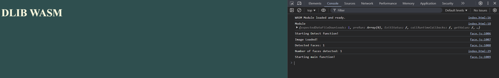

# Emscripten Build System for WASM Based Applications

## Install Emscripten Core SDK

`git clone https://github.com/emscripten-core/emsdk.git`

## Install and Activate

In your shell of choice, navigate to the emsdk directory and run the following commands:

`./emsdk install latest`

`./emsdk install activate` || `./emsdk install activate --permanent`

Run `./emsdk help` for more information.
https://emscripten.org/docs/tools_reference/emsdk.html#command-line-syntax

## Start Building Examples

Mac / Linux / Windows: `bash build.sh`

Run using VSCode's Live Server or any other server, to serve the HTML.

Note: If you are using Windows, using Wasmtime to run files requires .msi installation from https://github.com/bytecodealliance/wasmtime/releases.

Note: If you are using Windows, wat2wasm requires the WABT package from https://github.com/WebAssembly/wabt/releases and then ran via cmd. Ensure all path variables are set correctly.

Mac / Linux: `curl https://wasmtime.dev/install.sh -sSf | bash`

Otherwise, follow this guide: https://docs.wasmtime.dev/introduction.html for the most up-to-date usage of WASI.

## Get Started with Emscripten Compiler - emcc will output a.out.js & a.out.wasm, which can be run with Node.

Emscripten is a compiler that allows you to compile multi-lingual code to WebAssembly Binary by being tightly coupled with LLVM, Clang, Binaryen, and Closure Compiler.

For using EMCC in production, consider EMCC's compiler options and build flags, such as:

https://emscripten.org/docs/tools_reference/settings_reference.html?highlight=wasi#minimal-runtime-streaming-wasm-compilation

See https://emscripten.org/docs/getting_started/Tutorial.html#running-emscripten for more detail.

`emcc hello.c`

`node a.out.js`

## Build HTML - embedded only, no direct access to modules.

`"buildHTML": "emcc src/gol.cpp -o build/gol.html"`

See gol.html for example.

Note: It is recommended to pass optimization flags (O1-O3) and MINIFY_HTML=1 to reduce the size of the output.

`"buildHTML": "emcc src/gol.cpp -o build/gol.html -O3 -s MINIFY_HTML=1"`

## Build JS - embeddable, access to modules via Module.isRuntimeInitialized

See gol.js for example - https://webassembly.github.io/spec/js-api/#sample

`"buildAccessor": "emcc -o build/gol.js src/gol.cpp -s EXPORTED_RUNTIME_METHODS=['ccall'] -s EXPORTED_FUNCTIONS=\_main,\_myFunction"`

## Build WASM - standalone & embeddable.

More information about building WASM standalone using emcc, in relation to V8 - https://v8.dev/blog/emscripten-standalone-wasm

Use wasm-dis to view the binaries in text format. https://github.com/WebAssembly/binaryen/blob/main/src/tools/wasm-dis.cpp

`"buildWASM": "emcc src/gol.cpp -o build/gol.wasm -s STANDALONE_WASM=1 -s EXPORTED_FUNCTIONS=[_main,_myFunction]"`

`"buildSimple": "emcc src/c/simple.c -o build/simple.wasm -s STANDALONE_WASM=1 -s EXPORT_ALL=1"`

`"buildWAT": "wat2wasm src/wasm/memory.wat -o build/memory.wasm"`

## Example Vector Math Library - Comparison between C -> WASM Module vs Native JS (10, 50, and 100k Iterations)

`"buildVec": "emcc src/c/vectors.c -o build/vectors.wasm -s STANDALONE_WASM=1 -s EXPORTED_FUNCTIONS=_alloc_vector,_dealloc_vector,_add_vectors,_sub_vectors,_mul_scalar"`

## Build ASC - AssemblyScript - A TS Variant for WASM

A TypeScript-like language for WebAssembly.

https://www.assemblyscript.org/ uses https://github.com/WebAssembly/binaryen under the hood.

`"buildASC": "asc src/ts-asc/fib.ts --outFile build/assembly.wasm --optimize"`

## Run Standalone WASM - Wasmer or WasmTime - WASI (WebAssembly System Interface)

See the `src/wasi` directory for more information on WASI.

## Build from WAT Only - wat2wasm - WebAssembly Text Format

use wat2wasm to convert wat text file to wasm binaries. https://github.com/webassembly/wabt / https://github.com/xtuc/webassemblyjs/tree/master/packages/wast-loader

`"buildWASMOnly": "wat2wasm src/simple.wat -o build/simple.wasm"`

## Compile a library using the EMCC Toolchain and use it in a separate file

See /src/library/buildRules & htmlTestDlib/test.cpp for more information.

## Community Maintained Examples

To see more examples, visit https://github.com/emscripten-core/emscripten/wiki/Porting-Examples-and-Demos
