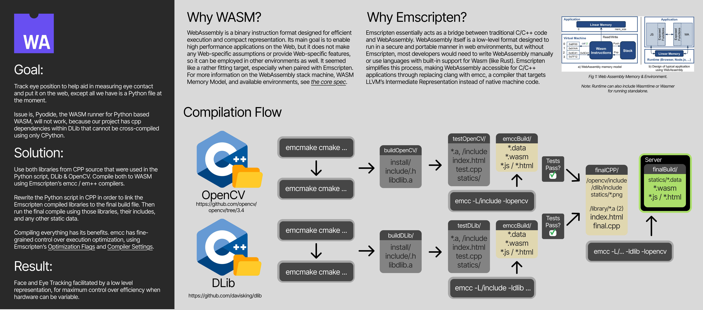
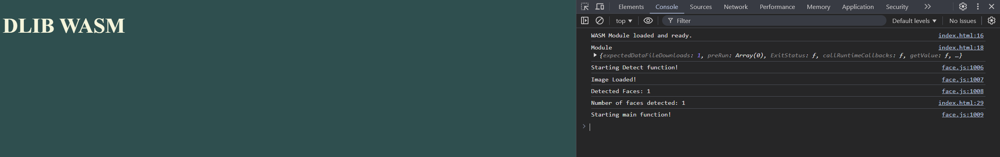
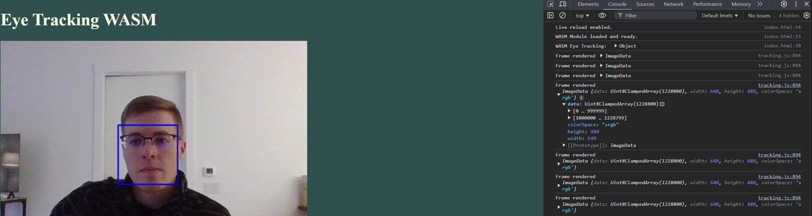
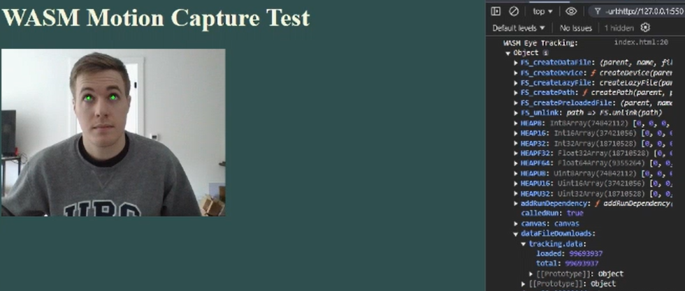

## Advanced Usage - Build Libraries for use in seperate files

See `src/library/*/build/*` for built examples.

See `src/library/cmake` for examples on compiling and including libraries in source builds.

In this advanced usage example, I show examples where Emscriptens VFS is used, as well as multi-compilation WASM programs that leverage SIMD intrinsically, without explicitly calling the `-msimd128` flag during compilation. (Hint: WebAssembly compilers can optimize memcpy calls to use SIMD instructions)

[How to use SIMD in Emscripten](https://emscripten.org/docs/porting/simd.html#using-simd-with-webassembly)
[Limits and Usecase](https://emscripten.org/docs/porting/simd.html)

Note: -msimd128 , -s USE_CLOSURE_COMPILER=1 and optimization flags like -O1, -O2, -O3 can be used to enable SIMD, further optimize the output for both JS and C++, and are recommended.

## Dlib Face Detection on Image loaded from EMCC's Virtual File System (Mona Lisa)

## Dlib Face Detection on Video Stream using Frontal Face Predictor

## OpenCV Eye Detection video stream using Dlib Facial Landmark Predictor

