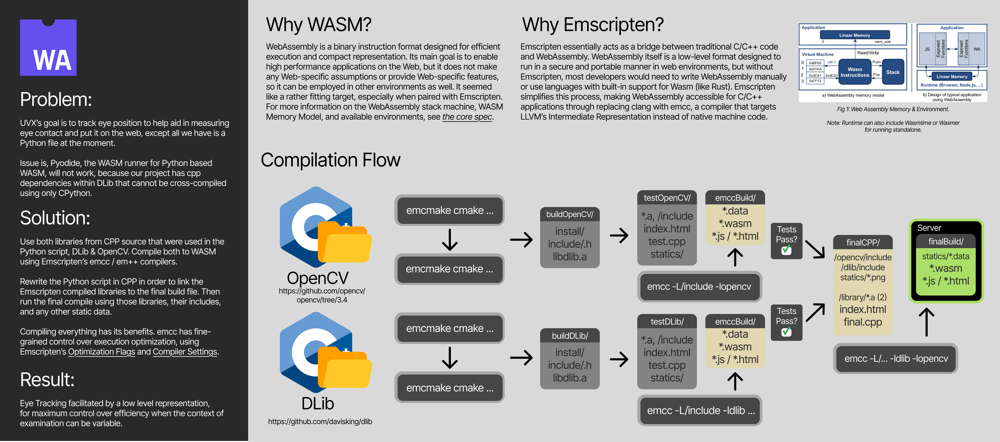

## Compiling DLib with the Emscripten Toolchain

[Diagram PDF](../../dlibemcc.pdf)

## EMCCMAKE Commands For Compiling DLib

1. First clone a copy of dlib from github, or use the one located in `libraries/statics`\
   `git clone https://github.com/davisking/dlib/tree/master`\
   review compilation notes: https://github.com/davisking/dlib/blob/master/examples/CMakeLists.txt

2. Create a build directory in the dlib directory.\
   `mkdir static_build`

3. Run the following command to build the dlib library with Emscripten.\
   `emcmake cmake -G Ninja -S ./statics/dlib -B ./statics/dlib/static_build -D BUILD_SHARED_LIBS=OFF -D CMAKE_MAKE_PROGRAM=C:/ninja-win/ninja.exe -D CMAKE_C_COMPILER=emsdk/upstream/emscripten/emcc -D CMAKE_CXX_COMPILER=emsdk/upstream/emscripten/em++ -D CMAKE_INSTALL_PREFIX=./statics/dlib/install`

4. cd to static_build then create install dir.

5. Run the following command:\
   `emmake ninja install`

6. The library will be installed in the install directory.

7. Resulting files will be located at:\
   `.A FILES: static_build/install/lib/libdlib.a`\
   `INCLUDE DIR: static_build/install/include/`

8. For an Emscripten pre-built version of DLib, see the paths below.\
   `library/htmlTestDlib/DLIBEMC/install/include/dlib/*.h`\
   `library/htmlTestDlib/DLIBEMC/install/lib/libdlib.a`

## Build the example test.cpp file (successful build already in /build/cargo/ccall/face.js)

1. First note the location of the following includes:\
   `-I"emsdk/upstream/emscripten/cache/sysroot/include"`\
   `-IDLIBEMC/install/include`

2. ensure we preload files. emscripten will generate a .data file that it will then look for.\
   pay attention to the browser console for which path it expects the .data to be at, move the .data file if necessary.

3. Note: in order to use ccall effectively, we need to export the function. we can do this by using the extern "C"
   keyword in C++ or by using the EMSCRIPTEN_KEEPALIVE macro.

4. Run the following command to build the test.cpp file. Ensure you cd into the htmlTestDLib folder.\
   Build with CCALL:\
    `emcc test.cpp -o build/cargo/ccall/face.js -I"DLIBEMC/install/include" -I"/emsdk/upstream/emscripten/cache/sysroot/include" -L"DLIBEMC/static_build/dlib" -ldlib -s EXPORT_ALL=1 -s EXPORTED_RUNTIME_METHODS=["ccall"] -s WASM=1 -s STACK_OVERFLOW_CHECK=2 -s ENVIRONMENT=web -s DISABLE_EXCEPTION_CATCHING=0 -s ASSERTIONS=1 --preload-file "/Documents/Work/Refactor Games/Eye Tracking/pyTrack/webapp/cpp/build/htmlTestDlib/build/monalisa.jpg@/monalisa.jpg"`

5. File can be run by using VS Code's Live Server, served from the htmlTestDLib folder. View the browser console for output.
